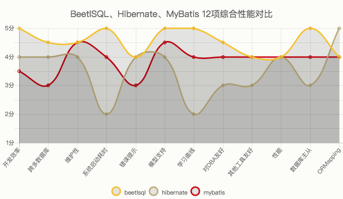

## BeetlSQL中文文档

>   -   作者: 闲大赋,Gavin.King,Sue,Zhoupan,woate
>   -   社区 [http://ibeetl.com](http://ibeetl.com/)
>   -   qq群 219324263
>   -   当前版本 2.7.3 , 另外还需要beetl([http://git.oschina.net/xiandafu/beetl2.0/attach_files](http://git.oschina.net/xiandafu/beetl2.0/attach_files)) 包


### 1. BeetlSQL 特点

BeetSql是一个全功能DAO工具， 同时具有Hibernate 优点 & Mybatis优点功能，适用于承认以SQL为中心，同时又需求工具能自动能生成大量常用的SQL的应用。

-   开发效率
    -   无需注解，自动使用大量内置SQL，轻易完成增删改查功能，节省50%的开发工作量
    -   数据模型支持Pojo，也支持Map/List这种快速模型，也支持混合模型
    -   SQL 模板基于Beetl实现，更容易写和调试，以及扩展
    -   可以针对单个表(或者视图）代码生成pojo类和sql模版，甚至是整个数据库。能减少代码编写工作量
-   维护性
    -   SQL 以更简洁的方式，Markdown方式集中管理，同时方便程序开发和数据库SQL调试。
    -   可以自动将sql文件映射为dao接口类
    -   灵活直观的支持支持一对一，一对多，多对多关系映射而不引入复杂的OR Mapping概念和技术。
    -   具备Interceptor功能，可以调试，性能诊断SQL，以及扩展其他功能
-   其他
    -   内置支持主从数据库支持的开源工具
    -   支持跨数据库平台，开发者所需工作减少到最小，目前跨数据库支持mysql,postgres,oracle,sqlserver,h2,sqllite.


### 2. 5分钟例子

#### 2.1. 安装

maven 方式:

```xml
<dependency>
	<groupId>com.ibeetl</groupId>
	<artifactId>beetlsql</artifactId>
	<version>2.7.3</version>
</dependency>
```

或者依次下载beetlsql，beetl 最新版本 包放到classpath里


#### 2.2. 准备工作

为了快速尝试BeetlSQL，需要准备一个Mysql数据库或者其他任何beetlsql支持的数据库，然后执行如下sql脚本

```sql
CREATE TABLE `user` (
	  `id` int(11) NOT NULL AUTO_INCREMENT,
	  `name` varchar(64) DEFAULT NULL,
	  `age` int(4) DEFAULT NULL,
	  `userName` varchar(64) DEFAULT NULL COMMENT '用户名称',
	  `roleId` int(11) DEFAULT NULL COMMENT '用户角色',
	  `date` datetime NULL DEFAULT NULL,
	  PRIMARY KEY (`id`)
) ENGINE=InnoDB DEFAULT CHARSET=utf8;
```

编写一个Pojo类，与数据库表对应（或者可以通过SQLManager的gen方法生成此类，参考一下节）

```java
import java.math.*;
import java.util.Date;

/*
*
* gen by beetlsql 2016-01-06
*/
public class User  {
	private Integer id ;
	private Integer age ;
	//用户角色
	private Integer roleId ;
	private String name ;
	//用户名称
	private String userName ;
	private Date date ;

}
```


#### 2.3. 代码例子

写一个java的Main方法，内容如下

```java
ConnectionSource source = ConnectionSourceHelper.getSimple(driver, url, "", userName, password);
DBStyle mysql = new MySqlStyle();
// sql语句放在classpagth的/sql 目录下
SQLLoader loader = new ClasspathLoader("/sql");
// 数据库命名跟java命名一样，所以采用DefaultNameConversion，还有一个是UnderlinedNameConversion，下划线风格的
所以采用DefaultNameConversion nc = new  所以采用DefaultNameConversion();
// 最后，创建一个SQLManager,DebugInterceptor 不是必须的，但可以通过它查看sql执行情况
SQLManager sqlManager = new SQLManager(mysql,loader,source,nc,new Interceptor[]{new DebugInterceptor()});


//使用内置的生成的sql 新增用户，如果需要获取主键，可以传入KeyHolder
User user = new User();
user.setAge(19);
user.setName("xiandafu");
sqlManager.insert(user);

//使用内置sql查询用户
int id = 1;
user = sqlManager.unique(User.class,id);

//模板更新,仅仅根据id更新值不为null的列
User newUser = new User();
newUser.setId(1);
newUser.setAge(20);
sqlManager.updateTemplateById(newUser);

//模板查询
User query = new User();
query.setName("xiandafu");
List<User> list = sqlManager.template(query);


//使用user.md 文件里的select语句，参考下一节。
User query2 = new User();
query.setName("xiandafu");
List<User> list2 = sqlManager.select("user.select",User.class,query2);
```


#### 2.4. SQL文件例子

通常一个项目还是有少量复杂sql，可能只有5，6行，也可能有上百行，放在单独的sql文件里更容易编写和维护，为了能执行上例的user.select,需要在classpath里建立一个sql目录（ClasspathLoader 配置成sql目录，参考上一节ClasspathLoader初始化的代码）以及下面的user.md 文件，内容如下

```markdown
select
===
select * from user where 1=1
@if(!isEmpty(age)){
and age = #age#
@}
@if(!isEmpty(name)){
and name = #name#
@}
```

关于如何写sql模板，会稍后章节说明，如下是一些简单说明。

-   采用md格式，===上面是sql语句在本文件里的唯一标示，下面则是sql语句。
-   @ 和回车符号是定界符号，可以在里面写beetl语句。
-   "#" 是占位符号，生成sql语句得时候，将输出？，如果你想输出表达式值，需要用text函数，或者任何以db开头的函数，引擎则认为是直接输出文本。
-   isEmpty是beetl的一个函数，用来判断变量是否为空或者是否不存在.
-   文件名约定为类名，首字母小写。

sql模板采用beetl原因是因为beetl 语法类似js，且对模板渲染做了特定优化，相比于mybatis，更加容易掌握和功能强大，可读性更好，也容易在java和数据库之间迁移sql语句


#### 2.5. 代码&sql生成

User类并非需要自己写，好的实践是可以在项目中专门写个类用来辅助生成pojo和sql片段，代码如下

```java
public static void main(String[] args){
	SqlManager sqlManager  = ...... //同上面的例子
	sqlManager.genPojoCodeToConsole("user");
	sqlManager.genSQLTemplateToConsole("user");
}
```

>   注意:我经常在我的项目里写一个这样的辅助类，用来根据表或者视图生成各种代码和sql片段，以快速开发.

genPojoCodeToConsole 方法可以根据数据库表生成相应的Pojo代码，输出到控制台，开发者可以根据这些代码创建相应的类，如上例子，控制台将输出

```java
package com.test;
import java.math.*;
import java.util.Date;
import java.sql.Timestamp;

/*
*
* gen by beetlsql 2016-01-06
*/
public class user  {
	private Integer id ;
	private Integer age ;
	//用户角色
	private Integer roleId ;
	private String name ;
	//用户名称
	private String userName ;
	private Date date ;

}
```

上述生成的代码有些瑕疵，比如包名总是com.test，类名是小写开头（因为用了DefaultNameConversion)，你需要修改成你要的包名和正常的类名，pojo类也没有生成getter，setter方法，你需要用ide自带的工具再次生成一下。

>   #### 注意
>
>   生成属性的时候，id总是在前面，后面依次是类型为Integer的类型，最后面是日期类型，剩下的按照字母排序放到中间。

一旦有了User 类，如果你需要些sql语句，那么genSQLTemplateToConsole 将是个很好的辅助方法，可以输出一系列sql语句片段，你同样可以赋值粘贴到代码或者sql模板文件里（user.md),如上例所述，当调用genSQLTemplateToConsole的时候，生成如下

```markdown
sample
===
* 注释

	select #use("cols")# from user where #use("condition")#

cols
===

	id,name,age,userName,roleId,date

updateSample
===

	`id`=#id#,`name`=#name#,`age`=#age#,`userName`=#userName#,`roleId`=#roleId#,`date`=#date#

condition
===

	1 = 1
	@if(!isEmpty(name)){
	 and `name`=#name#
	@}
	@if(!isEmpty(age)){
	 and `age`=#age#
	@}
```

beetlsql生成了用于查询，更新，条件的sql片段和一个简单例子。你可以按照你的需要copy到sql模板文件里.实际上，如果你熟悉gen方法，你可以直接gen代码和sql到你的工程里，甚至是整个数据库都可以调用genAll来一次生成

>   #### 注意
>
>   sql 片段的生成顺序按照数据库表定义的顺序显示


### 3. BeetlSQL 说明

#### 3.1. 获得SQLManager

SQLManager 是系统的核心，他提供了所有的dao方法。获得SQLManager，可以直接构造SQLManager.并通过过单例获取如：

```java
ConnectionSource source = ConnectionSourceHelper.getSimple(driver, url, "", userName, password);
DBStyle mysql = new MySqlStyle();
// sql语句放在classpagth的/sql 目录下
SQLLoader loader = new ClasspathLoader("/sql");
// 数据库命名跟java命名一样，所以采用DefaultNameConversion，还有一个是UnderlinedNameConversion，下划线风格的
UnderlinedNameConversion nc = new  UnderlinedNameConversion();
// 最后，创建一个SQLManager,DebugInterceptor 不是必须的，但可以通过它查看sql执行情况
SQLManager sqlManager = new SQLManager(mysql,loader,source,nc,new Interceptor[]{new DebugInterceptor()});
```

更常见的是，已经有了DataSource，创建ConnectionSource 可以采用如下代码

```java
ConnectionSource source = ConnectionSourceHelper.single(datasource);
```

如果是主从Datasource

```java
ConnectionSource source = ConnectionSourceHelper.getMasterSlave(master,slaves)
```


#### 3.2. 查询API

##### 3.2.1. 模板类查询（自动生成sql）

-   public <T> List<T> all(Class<T> clazz) 查询出所有结果集
-   public <T> List<T> all(Class<T> clazz, int start, int size) 翻页
-   public int allCount(Class<?> clazz) 总数
-   public <T> List<T> template(T t) 根据模板查询，返回所有符合这个模板的数据库 同上，mapper可以提供额外的映射，如处理一对多，一对一
-   public <T> List<T> template(T t,int start,int size) 同上，可以翻页
-   public <T> long templateCount(T t) 获取符合条件的个数

翻页的start，系统默认位从1开始，为了兼容各个数据库系统，会自动翻译成数据库习俗，比如start为1，会认为mysql，postgres从0开始（从start－1开始），oralce从1开始（start－0）开始。

然而，如果你只用特定数据库，可以按照特定数据库习俗来，比如，你只用mysql，start为0代表起始纪录，需要配置

```properties
OFFSET_START_ZERO = true
```

这样，翻页参数start传入0即可。

注意:根据模板查询并不包含时间字段，也不包含排序，然而，可以通过在pojo class上使用@TableTemplate() 或者日期字段的getter方法上使用@DateTemplate()来定制，如下:

```java
@TableTemplate("order by id desc ")
public class User  {
	private Integer id ;
	private Integer age ;
	// ...
	@DateTemplate(accept="minDate,maxDate")
	public Date getDate() {
		return date;
	}
}
```

这样，模板查询将添加order by id desc ,以及date字段将按照日期范围来查询。 具体参考annotation一章

##### 3.2.2. 通过sqlid查询,sql语句在md文件里

-   public <T> List<T> select(String sqlId, Class<T> clazz, Map<String, Object> paras) 根据sqlid来查询，参数是个map
-   public <T> List<T> select(String sqlId, Class<T> clazz, Object paras) 根据sqlid来查询，参数是个pojo
-   public <T> List<T> select(String sqlId, Class<T> clazz, Map<String, Object> paras, int start, int size)， 增加翻页
-   public <T> List<T> select(String sqlId, Class<T> clazz, Object paras, int start, int size) ，增加翻页
-   public <T> T selectSingle(String id,Object paras, Class<T> target) 根据sqlid查询，输入是Pojo，将对应的唯一值映射成指定的taget对象，如果未找到，则返回空。需要注意的时候，有时候结果集本生是空，这时候建议使用unique
-   public <T> T selectSingle(String id,Map<String, Object> paras, Class<T> target) 根据sqlid查询，输入是Map，将对应的唯一值映射成指定的taget对象，如果未找到，则返回空。需要注意的时候，有时候结果集本生是空，这时候建议使用unique
-   public <T> T selectUnique(String id,Object paras, Class<T> target) 根据sqlid查询，输入是Pojo或者Map，将对应的唯一值映射成指定的taget对象,如果未找到，则抛出异常
-   public <T> T selectUnique(String id,Map<String, Object> paras, Class<T> target) 根据sqlid查询，输入是Pojo或者Map，将对应的唯一值映射成指定的taget对象,如果未找到，则抛出异常
-   public Integer intValue(String id,Object paras) 查询结果映射成Integer，如果找不到，返回null，输入是object
-   public Integer intValue(String id,Map paras) 查询结果映射成Integer，如果找不到，返回null，输入是map，其他还有 longValue，bigDecimalValue
-   public <T> T unique(Class<T> clazz,Object pk) 根据主键查询，如果未找到，抛出异常.


#### 3.3. 翻页查询API

-   public <T> void pageQuery(String sqlId,Class<T> clazz,PageQuery query)

BeetlSQL 提供一个PageQUery对象,用于web应用的翻页查询,BeetlSql假定有sqlId 和sqlId$count,俩个sqlId,并用这来个来翻页和查询结果总数.如:

```markdown
queryNewUser
===
select * from user order by id desc ;

queryNewUser$count
===
select count(1) from user
```

对于俩个相似的sql语句,你可以使用use函数,把公共部分提炼出来.

大部分情况下,都不需要2个sql来完成,一个sql也可以,要求使用page函数或者pageTag标签,这样才能同时获得查询结果集总数和当前查询的结果

```markdown
queryNewUser
===
select
@pageTag(){
a.*,b.name role_name
@}
from user a left join b ...
```

如上sql,会在查询的时候转为俩条sql语句

```sql
select count(1) from user a left join b...
select a.*,b.name role_name  from user a left join b...
```

如果字段较多,为了输出方便,也可以使用pageTag,字段较少,用page函数也可以. ,具体参考pageTag和page函数说明.翻页代码如下

```java
//从第一页开始查询,无参数
PageQuery query = new PageQuery();
sql.pageQuery("user.queryNewUser", User.class,query);
System.out.println(query.getTotalPage());
System.out.println(query.getTotalRow());
System.out.println(query.getPageNumber());
List<User> list = query.getList();
```

PageQuery 对象也提供了 orderBy属性，用于数据库排序，如 "id desc"

>   #### 跨数据库支持
>
>   如果你打算使用PageQuery做翻页,且只想提供一个sql语句+page函数,那考虑到垮数据库,应该不要在这个sql语句里包含排序,因为大部分数据库都不支持. page函数生成的查询总数sql语句,因为包含了oder by,在大部分数据库都是会报错的的,比如:select count(1) form user order by name,在sqlserver,mysql,postgres都会出错,oracle允许这种情况, 因此,如果你要使用一条sql语句+page函数,建议排序用PageQuery对象里有排序属性oderBy,可用于排序,而不是放在sql语句里.
>
>   如果你不打算使用PageQuery+一条sql的方式,而是用俩条sql来分别翻页查询和统计总数,那无所谓
>
>   或者你直接使用select 带有起始和读取总数的接口,也没有关系,可以在sql语句里包含排序


#### 3.4. 更新API

##### 3.4.1. 自动生成sql

-   public void insert(Class<?> clazz,Object paras) 插入paras到paras关联的表
-   public void insert(Class<?> clazz,Object paras,KeyHolder holder)，插入paras到paras关联的表，如果需要主键，可以通过holder的getKey来获取
-   public int insert(Class clazz,Object paras,boolean autoAssignKey) 插入paras，并且指定是否自动将数据库主键赋值到paras里
-   public int updateById(Object obj) 根据主键更新，主键通过annotation表示，如果没有，则认为属性id是主键，所有值参与更新
-   public int updateTemplateById(Object obj) 根据主键更新，组件通过annotation表示，如果没有，则认为属性id是主键,属性为null的不会更新
-   public int updateTemplateById(Class<?> clazz，Map paras) 根据主键更新，组件通过clazz的annotation表示，如果没有，则认为属性id是主键,属性为null的不会更新。
-   public int[] updateByIdBatch(List<?> list) 批量更新
-   public void insertBatch(Class clazz,List<?> list) 批量插入数据

##### 3.4.2. 通过sqlid更新

-   public int insert(String sqlId,Object paras,KeyHolder holder) 根据sqlId 插入，并返回主键，主键id由paras对象所指定
-   public int insert(String sqlId,Object paras,KeyHolder holder,String keyName) 同上，主键由keyName指定
-   public int insert(String sqlId,Map paras,KeyHolder holder,String keyName)，同上，参数通过map提供
-   public int update(String sqlId, Object obj) 根据sqlid更新
-   public int update(String sqlId, Map<String, Object> paras) 根据sqlid更新，输出参数是map
-   public int[] updateBatch(String sqlId,List<?> list) 批量更新
-   public int[] updateBatch(String sqlId,Map<String, Object>[] maps) 批量更新，参数是个数组，元素类型是map


#### 3.5. 直接执行SQL

##### 3.5.1. 直接执行sql模板语句

-   public <T> List<T> execute(String sql,Class<T> clazz, Object paras)
-   public <T> List<T> execute(String sql,Class<T> clazz, Map paras)
-   public int executeUpdate(String sql,Object paras) 返回成功执行条数
-   public int executeUpdate(String sql,Map paras) 返回成功执行条数

#### 3.5.2. 直接执行JDBC sql语句

-   查询 public <T> List<T> execute(SQLReady p,Class<T> clazz) SQLReady包含了需要执行的sql语句和参数，clazz是查询结果，如

```java
List<User> list = sqlManager.execute(new SQLReady("select * from user where name=? and age = ?","xiandafu",18),User.class);)
```

-   更新 public int executeUpdate(SQLReady p) SQLReady包含了需要执行的sql语句和参数，返回更新结果

-   直接使用Connection public <T> T executeOnConnection(OnConnection<T> call),使用者需要实现onConnection方法的call方法，如调用存储过程

```java
String md5 = sql.executeOnConnection(new OnConnection<String>(){
	@Override
	public String call(Connection conn) throws SQLException {
		CallableStatement cstmt = conn.prepareCall("{ ? = call md5( ? ) }");
		// 其他代码
		return true;
	}
});
```

    ​

#### 3.6. 其他

##### 3.6.1. 强制使用主或者从

-   public void useMaster(DBRunner f) DBRunner里的beetlsql调用将使用主数据库库
-   public void useSlave(DBRunner f) DBRunner里的beetlsql调用将使用从数据库库

##### 3.6.2. 生成Pojo代码和SQ片段

用于开发阶段根据表名来生成pojo代码和相应的sql文件

-   genPojoCodeToConsole(String table), 根据表名生成pojo类，输出到控制台.
-   genSQLTemplateToConsole(String table),生成查询，条件，更新sql模板，输出到控制台。
-   genPojoCode(String table,String pkg,String srcPath,GenConfig config) 根据表名，包名，生成路径，还有配置，生成pojo代码
-   genPojoCode(String table,String pkg,GenConfig config) 同上，生成路径自动是项目src路径，或者src/main/java (如果是maven工程)
-   genPojoCode(String table,String pkg),同上，采用默认的生成配置
-   genSQLFile(String table), 同上，但输出到工程，成为一个sql模版,sql模版文件的位置在src目录下，或者src／main／resources（如果是maven）工程.
-   genALL(String pkg,GenConfig config,GenFilter filter) 生成所有的pojo代码和sql模版，
-   genBuiltInSqlToConsole(Class z) 根据类来生成内置的增删改查sql语句，并打印到控制台

```java
sql.genAll("com.test", new GenConfig(), new GenFilter(){
	public boolean accept(String tableName){
		if(tableName.equalsIgnoreCase("user")){
			return true;
		}else{
			return false;
		}
		// return false
	}
});
```

第一个参数是pojo类包名，GenConfig是生成pojo的配置，GenFilter 是过滤，返回true的才会生成。如果GenFilter为null，则数据库所有表都要生成

>   #### 警告
>
>   必须当心覆盖你掉你原来写好的类和方法，不要轻易使用genAll，如果你用了，最好立刻将其注释掉，或者在genFilter写一些逻辑保证不会生成所有的代码好sql模板文件


### 4. 命名转化，表和列名映射

Beetlsql 默认提供了三种列明和属性名的映射类。

-   DefaultNameConversion 数据库名和java属性名保持一致，如数据库表User，对应Java类也是User，数据库列是sysytemId,则java属性也是systemId，反之亦然
-   UnderlinedNameConversion 将数据库下划线去掉，首字母大写，如数据库是SYS_USER（oralce数据库的表和属性总是大写的), 则会改成SysUser
-   JPANameConversion 支持JPA方式的映射，适合不能用确定的映射关系
-   自定义命名转化，如果以上3个都不合适,可以自己实现一个命名转化。实现DefaultNameConversion实现方式
-   因为数据库表和列都忽略大小写区别，所以，实现NameConversion也不需要考虑大小写

```java
public class DefaultNameConversion extends NameConversion {

	@Override
	public String getTableName(Class<?> c) {
		Table table = (Table)c.getAnnotation(Table.class);
		if(table!=null){
			return table.name();
		}
		return c.getSimpleName();
	}

	@Override
	public String getColName(Class<?> c, String attrName) {
		return attrName;
	}

	@Override
	public String getPropertyName(Class<?> c, String colName) {
		return colName;
	}

}
```

如果有特殊的表并不符合DefaultNameConversion实现方式，你可以重新实现上面的三个方法


### 5. 复合主键

beetlsql 支持复合主键，无需像其他dao工具那样创建一个特别的主键对象，主键对象就是实体对象本生

```sql
CREATE TABLE `party` (
  `id1` int(11) NOT NULL,
  `id2` int(11) NOT NULL,
  `name` varchar(45) DEFAULT NULL,
  PRIMARY KEY (`id1`,`id2`)
) ENGINE=InnoDB DEFAULT CHARSET=latin1;
```

Party代码如下

```java
public class Party  {
	private Integer id1 ;
	private Integer id2 ;
	private String name ;
	//忽略其他 getter setter方法
}
```

根据主键获取Party

```java
Party key = new Party();
key.setId1(1);
key.setId2(2);
Party party = sql.unique(Party.class, key);
```


### 6. 使用Mapper

SQLManager 提供了所有需要知道的API，但通过sqlid来访问sql有时候还是很麻烦，因为需要手敲字符串，另外参数不是map就是para，对代码理解没有好处，BeetlSql支持Mapper，将sql文件映射到一个interface。如下示例

```java
public interface UserDao extends BaseMapper<User> {
	// 使用"user.getCount"语句,无参数
	public int getCount();
	//使用"user.setUserStatus" 语句
	public void setUserStatus(Map paras); //更新用户状态
	public void setUserAnnotherStatus(User user); //更新用户状态
	//使用"user.findById", 传入参数id
	public User findById(@Param("id") Integer id);
	//or 使用params，一一对应
	@SqlStatement(params="id,status")
	public User findByIdAndStatus( Integer id,Integer status);
	//翻页查询，使用"user.queryNewUser"
	public void queryNewUser(PageQuery query) ;
	// 使用_st,_sz 翻页
	@SqlStatement(params="name,age,_st,_sz")
	public List<User> queryUser( String name, Integer age,int start, int size);
	//使用sqlready
	@Sql(value=" update user set age = ? where id = ? ")
	public void updateAge(int age,int id);

	@Sql(value=" select name from user",returnType=String.class)
	public List<String> allNames();

}
```

-   Interface 可以继承BaseMapper，这样可以使用BaseMapper的一些公共方法，如insert，unqiue,single,updateById,deleteById等，也可以不继承

-   Interface里的方法名与Sql文件对应，如果方法名对应错了，会在调用的时候报错找不到sql。

-   方法参数可以是一个Object,或者是Map，这样，BeetlSql 自动识别为 sql的参数，也可以使用注解@Param来标注，或者混合这俩种情况 如:

```java
public void setUserStatus(Map paras,@Param("name") String name);
}
```

方法如果是查询语句，可以使用@RowStart，@RowSize 作为翻页参数，BeetlSQL将自动完成翻页功能

注意 BeetlSQL 会根据 对应的方法对应的SQL语句，解析开头，如果是select开头，就认为是select操作，同理还有update，delete，insert。如果sql 模板不是以这些关键字开头，则需要使用注解 @SqlStatement

```java
@SqlStatement(type=SqlStatementType.INSERT)
public KeyHolder newUser(User user);// 添加用户
```

SqlStatement 也可在params申明参数名称

```java
public List<User> queryUser(@Param("name") String name,@Param("age") Integer age,@RowStart int start,@RowSize int size);
// or
@SqlStatement(params="name,age,_st,_se")
public List<User> queryUser(String name,Integer age,int start,int size);
```

-   查询语句返回的是List，则对应SQLManager.select
-   查询语句返回的是Pojo，原始类型等非List类型，则对应的SQLManager.selectSignle，如上面的getCount
-   insert 语句 如果有KeyHolder，则表示需要获取主键，对应SQLManager.insert(…​.,keyHolder)方法
-   参数列表里只允许有一个Pojo或者Map，作为查询参数_root，否则，需要加上@Param
-   参数列表里如果有List 或者Map[],则期望对应的是一个updateBatch操作
-   参数列表里如果@RowStart ,@RowSize,则认为是翻页语句
-   参数里如果有PageQuery,则认为是翻页查询
-   在查询中，返回的是List，但类型非Mapper指定的类型，无论是用@Sql ,还是 @SqlStatement，需要用returnType来说明，如上例子allNames 返回一个List<String>而不是List<User>,因此需要使用returnType做额外说明

Mapper 也支持使用JDBC SQL，这时候需要采用Sql注解

```java
@Sql(value=" update user set age = ? where id = ? ")
public void updateAge(int age,int id);
@Sql("select * from user  ")
public List<User> selectAll();
```

使用Mapper能增加Dao维护性，并能提高开发效率，建议在项目中使用。


### 7. BeetlSQL Annotation

对于自动生成的sql，默认不需要任何annotaton，类名对应于表名（通过NameConverstion类），getter方法的属性名对应于列明（也是通过NameConverstion类），但有些情况还是需要anntation。

#### 7.1. @AutoID 和 @AssignID ，@SeqID

-   @AutoID,作用于getter方法，告诉beetlsql，这是自增主键,对应于数据自增长
-   @AssignID，作用于getter方法，告诉beetlsql，这是程序设定

```java
@AssignID()
public Long getId() {
	return id;
}
```

代码设定主键允许像@AssignID 传入id的生成策略以自动生成序列，beetl默认提供了一个snowflake算法，一个用于分布式环境的id生成器([https://github.com/twitter/snowflake](https://github.com/twitter/snowflake))

```java
@AssignID("simple")
public Long getId() {
	return id;
}
```

simple 是beetlsql提供的一个默认的snowflake实现，你可以通过sqlManager自己注册id生成器

```java
sqlManager.addIdAutonGen("uuid2", new IDAutoGen(){
	@Override
	public Object nextID(String params) {
		return "hi"+new Random().nextInt(10000);
	}
});
```

```java
@AssignID("uuid2")
public Long getId() {
	return id;
}
```

-   @SeqID(name="xx_seq"，作用于getter方法，告诉beetlsql，这是序列主键。

对于属性名为id的自增主键，不需要加annotation，beetlsql默认就是@AutoID

>   #### 备注
>
>   -   对于支持多种数据库的，这些annotation可以叠加在一起


#### 7.2. @Tail

@Tail作用于类上，表示该对象是混合模型，参考下一章混合模型,sql查询无法在pojo映射的列或者结果集将使用Tail指定的方法


#### 7.3. @ColumnIgnore

在beetlsql 内置的insert或者update方法的时候，使用此注解的字段（作用于getter方法）将根据注解的属性来决定是否忽略此字段

```java
@ColumnIgnore(insert=true,update=false)
public Date getBir(){
	return  bir;
}
```

如上例子，插入的时候忽略bir属性（往往是因为数据库指定了默认值为当前时间），更新的时候不能忽略 @ColumnIgnore的insert默认是true，update是false，因此也可以直接用 @ColumnIgnore()


#### 7.4. @EnumMapping

对于Entity使用了枚举作为属性值，可以再枚举类上定义EnumMapping，指出如何将枚举与数据库值互相转化，有四种方法

-   如果没有使用@EnumMapping，则使用枚举的名称作为属性
-   @EnumMapping(EnumMapping.EnumType.STRING) 同上，使用枚举名称作为属性，数据库对应列应该是字符列
-   @EnumMapping(EnumMapping.EnumType.ORDINAL) 使用枚举的顺序作为属性，数据库对应列应该是int类型，用此作为映射需要防止重构枚举的时候导致数据库也重构，应该慎用
-   @EnumMapping(“xxx”)，如果不是上面的的定义，则beetlsql会查找枚举类的xxx属性，用这个值作为属性，比如

```java
@EnumMapping("value")
public enum Color {
	RED("RED",1),BLUE ("BLUE",2);
	private String name;
	private int value;
	private Color(String name, int value) {
	    this.name = name;
	    this.value = value;
	}
	public String getName() {
		return name;
	}
	public void setName(String name) {
		this.name = name;
	}
	public int getValue() {
		return value;
	}
	public void setValue(int value) {
		this.value = value;
	}

}
```

beetlsq 会获取枚举的value属性（调用getValue)来获取枚举属性值


#### 7.5. @Table

标签 @Table(name="xxxx") 告诉beetlsql，此类对应xxxx表。比如数据库有User表，User类对应于User表，也可以创建一个UserQuery对象，也对应于User表

```java
@Table(name="user")
public class QueryUser ..
```

注：可以为对象指定一个数据库shcema，如name="cms.user",此时将访问cms库（或者cms用户，对不同的数据库，称谓不一样）下的user数据表


#### 7.6. @TableTemplate

-   @TableTemplate() 用于模板查询，如果没有任何值，将按照主键降序排，也就是order by 主键名称 desc
-   @DateTemplate()，作用于日期字段的getter方法上，有俩个属性accept 和 compare 方法，分别表示 模板查询中，日期字段如果不为空，所在的日期范围，如

```java
@DateTemplate(accept="minDate,maxDate",compare=">=,<")
	public Date getDate() {
}
```

在模板查询的时候，将会翻译成

```javascript
@if(!isEmpty(minDate)){
 and date>=#minDate#
@}
@if(!isEmpty(maxDate)){
 and date<#maxDate#
@}
```

>   #### 注意
>
>   minDate,maxDate 是俩个额外的变量,需要定义到pojo类里，DateTemplate也可以有默认值，如果@DateTemplate()，相当于@DateTemplate(accept="min日期字段,max日期字段",compare=">=,<")


#### 7.7. Mapper相关注解

Mapper 是将sql模板文件映射成一个具体的Dao方法类,这样方位代码开发和维护

Mapper中的注解，包括常用的	SqlStatement ，SqlStatementType ，Sql,Param 还有不常用的 RowSize ，RowStart，具体参考Mapper


#### 7.8. ORMQuery

beetlsql 支持在实体类上增加ORMQuery注解,这样对于实体的查询,会触发懒加载,从而实现ORM 查询功能,具体参考ORM 查询一章


### 8. BeetlSQL 数据模型

BeetlSQL是一个全功能DAO工具，支持的模型也很全面，包括

-   Pojo, 也就是面向对象Java Objec。Beetlsql操作将选取Pojoe属性和sql列的交集。额外属性和额外列将忽略.
-   Map/List, 对于一些敏捷开发，可以直接使用Map/List 作为输入输出参数

```java
List<Map<String,Object>> list = sqlManager.select("user.find",Map.class,paras);
```

-   混合模型，推荐使用混合模型。兼具灵活性和更好的维护性。Pojo可以实现Tail（尾巴的意思)，或者继承TailBean，这样查询出的ResultSet 除了按照pojo进行映射外，无法映射的值将按照列表/值保存。如下一个混合模型:

```java
/*混合模型*/
public User extends TailBean{
	private int id ;
	private String name;
	private int roleId;
	/*以下是getter和setter 方法*/
}
```

对于sql语句:

```markdown
selectUser
===
select u.*,r.name r_name from user u left join role r on u.roleId=r.id .....
```

执行查询的时候

```java
List<User> list = sqlManager.select("user.selectUser",User.class,paras);
for(User user:list){
	System.out.println(user.getId());
	System.out.println(user.get("rName"));
}
```

程序可以通过get方法获取到未被映射到pojo的值，也可以在模板里直接 ${user.rName} 显示（对于大多数模板引擎都支持）

另外一种更自由的实现混合模型的方法是在目标Pojo上采用注解@Tail，如果注解不带参数，则默认会调用set(String,Object) 方法来放置额外的查询属性，否则，依据注解的set参数来确定调用方法

```java
@Tail(set="addValue")
public class User  {
	private Integer id ;
	private Integer age ;
	public User addValue(String str,Object ok){
		ext.put(str, ok);
		return this;
	}
```


### 9. Markdown方式管理

BeetlSQL集中管理SQL语句，SQL 可以按照业务逻辑放到一个文件里，文件名的扩展名是md或者sql。如User对象放到user.md 或者 user.sql里，文件可以按照模块逻辑放到一个目录下。文件格式抛弃了XML格式，采用了Markdown，原因是

-   XML格式过于复杂，书写不方便
-   XML 格式有保留符号，写SQL的时候也不方便，如常用的< 符号 必须转义
-   MD 格式本身就是一个文档格式，也容易通过浏览器阅读和维护

目前SQL文件格式非常简单，仅仅是sqlId 和sql语句本身，如下

```markdown
文件一些说明，放在头部可有可无，如果有说明，可以是任意文字
SQL标示
===
以*开头的注释
SQL语句

SQL标示2
===
SQL语句 2
```

所有SQL文件建议放到一个sql目录，sql目录有多个子目录，表示数据库类型，这是公共SQL语句放到sql目录下，特定数据库的sql语句放到各自自目录下 当程序获取SQL语句得时候，先会根据数据库找特定数据库下的sql语句，如果未找到，会寻找sql下的。如下代码

```java
List<User> list = sqlManager.select("user.select",User.class);
```

SqlManager 会根据当前使用的数据库，先找sql/mysql/user.md 文件，确认是否有select语句，如果没有，则会寻找sql/user.md

>   #### 注
>
>   -   注释是以* 开头，注释语句不作为sql语句
>   -   默认的ClasspathLoader采用了这种方法，你可以实现SQLLoader来实现自己的格式和sql存储方式，如数据库存储


### 10. SQL 注释

对于采用Markdown方式，可以采用多种方式对sql注释。

-   采用sql 自己的注释符号，"-- " ,优点是适合java和数据库sql之间互相迁移，如

```sql
select * from user where
--  status 代表状态
statu = 1
```

-   采用beetl注释

```sql
select * from user where
@ /* 这些sql语句被注释掉
statu = 1
@ */
```

-   在sqlId 的=== 紧挨着的下一行 后面连续使用“*”作为sql整个语句注释

```markdown
selectByUser
==
* 这个sql语句用来查询用户的
* status =1 表示查找有效用户

select * from user where status = 1
```


### 11. (重要) 配置beetlsql

beetlsql 配置文件是 btsql-ext.properties，位于classpath 根目录下，如果没有此文件，beetlsql将使用系统默认配置，如 * 是开发模式，beetlsql每次运行sql都会检测sql文件是否变化，并重新加载 * 字符集，是系统默认的字符集 * 翻页默认总是从1开始，对于oralce数据库来说，翻页起始参数正合适。对于mysql其他数据库来说，beetlsql，翻页参数变成n-1.一般你不需要关心

#### 11.1. 开发模式和产品模式

beetlsql默认是开发模式，因此修改md的sql文件，不需要重启。但建议线上不要使用开发模式，因为此模式会每次sql调用都会检测md文件是否变化。可以通过修改/btsql-ext.properties ,修改如下属性改为产品模式

```properties
PRODUCT_MODE = true
```


#### 11.2. NameConversion

数据库字段名与java属性名的映射关系必须配置正确，否则会导致各种问题，如下是一些建议

字段名字是user_id, java属性名是userId, 则使用UnderlinedNameConversion 字段名是userId, java属性名是userId，则使用DefaultNameConversion

如果是其他映射关系，可以考虑自己实现NameConversion接口


#### 11.3. 模板字符集

默认sql模板文件采用的是系统默认字符集，可以更改配置采用指定的字符集

```properties
CHARSET = UTF-8
```


#### 11.4. 翻页起始参数是0还是1

默认认为1对应于翻页的第一条记录，如果你习惯mysql 那种0对应于第一条记录，则需要配置OFFSET_START_ZERO，设置为true

```properties
OFFSET_START_ZERO =  true
```

无论是从0开始还是从开始，都不影响beetlsql根据特定数据库翻译成目标数据库的sql语句，这只是一个个人习惯，如系统只有mysql数据库 那从0开始，比较符合mysql的习惯。


#### 11.5. 自定义方法和标签函数

可以在sql模板中使用自定义方法和标签函数，具体请参考beetl使用说明，如下是默认配置

```properties
FN.use = org.beetl.sql.core.engine.UseFunction
FN.globalUse = org.beetl.sql.core.engine.GlobalUseFunction
FN.text = org.beetl.sql.core.engine.TextFunction
FN.join = org.beetl.sql.ext.JoinFunction
FN.isEmpty=org.beetl.sql.ext.EmptyExpressionFunction
FN.page=org.beetl.sql.core.engine.PageQueryFuntion
TAG.trim= org.beetl.sql.core.engine.TrimTag
TAG.pageTag= org.beetl.sql.core.engine.PageQueryTag
```

EmptyExpressionFunction 用在很多地方,如template 类操作,where语句里的条件判断,它 沿用了beetl习惯,对于不存在的变量,或者为null的变量,都返回true,同时如果是字符串,为空字符串也返回true,数组,集合也是这样,有些项目,认为空字符串应该算有值而不应该返回true,你可以参考EmptyExpressionFunction的实现,按照项目语义来定义isEmpty


### 12. SQL 模板基于Beetl实现

SQL语句可以动态生成，基于Beetl语言，这是因为

-   beetl执行效率高效 ，因此对于基于模板的动态sql语句，采用beetl非常合适
-   beetl 语法简单易用，可以通过半猜半式的方式实现，杜绝myBatis这样难懂难记得语法。BeetlSql学习曲线几乎没有
-   利用beetl可以定制定界符号，完全可以将sql模板定界符好定义为数据库sql注释符号，这样容易在数据库中测试，如下也是sql模板（定义定界符为"--:" 和 null,null是回车意思);

```markdown
selectByCond
===
select * from user where 1=1
--:if(age!=null)
age=#age#
--:}
```

-   beetl 错误提示非常友好，减少写SQL脚本编写维护时间
-   beetl 能容易与本地类交互（直接访问Java类），能执行一些具体的业务逻辑 ，也可以直接在sql模板中写入模型常量，即使sql重构，也会提前解析报错
-   beetl语句易于扩展，提供各种函数，比如分表逻辑函数，跨数据库的公共函数等

如果不了解beetl，可先自己尝试按照js语法来写sql模板，如果还有疑问，可以查阅官网 [http://ibeetl.com](http://ibeetl.com/)


### 13. Beetl 入门

Beetl 语法类似js，java，如下做简要说明，使用可以参考 [http://ibeetl.com](http://ibeetl.com/) , 或者在线体验 [http://ibeetl.com:8080/beetlonline/](http://ibeetl.com:8080/beetlonline/)

#### 13.1. 定界符号

默认的定界符号是@ 和 回车。 里面可以放控制语句，表达式等语，，站位符号是##,站位符号默认是输出？，并在执行sql的传入对应的值。如果想在占位符号输出变量值，则需要使用text函数

```javascript
@if(!isEmpty(name)){
	and name = #name#
}
```

如果想修改定界符，可以增加一个/btsql-ext.properties. 设置如下属性

```properties
DELIMITER_PLACEHOLDER_START=#
DELIMITER_PLACEHOLDER_END=#
DELIMITER_STATEMENT_START=@
DELIMITER_STATEMENT_END=
```

beetlsql 的其他属性也可以在此文件里设置


#### 13.2. 变量

通过程序传入的变量叫全局变量，可以在sql模板里使用，也可以定义变量，如

```javascript
@var count = 3;
@var status = {"a":1}  //json变量
```


#### 13.3. 算数表达式

同js，如a+1-b%30, i++ 等

```sql
select * from user where name like #'%'+name+'%'#
```


#### 13.4. 逻辑表达式

有“&&” “||” ，还有 “！”，分别表示与，或，非， beetl也支持三元表达式

```markdown
#user.gender==1?'女':'男'#
```


#### 13.5. 控制语句

-   if else 这个同java，c，js。
-   for,循环语句，如for(id:ids){}

```markdown
select * from user where status in (
@for(id in ids){
#id#  #text(idLP.last?"":"," )#
@}
```

>   #### 注意
>
>   -   变量名＋LP 是一个内置变量，包含了循环状态，具体请参考beetl文档，text方法表示直接输出文本而不是符号“？”
>   -   关于 sql中的in，可以使用内置的join方法更加方便

-   while 循环语句 ，如while(i<count))


#### 13.6. 访问变量属性

-   如果是对象，直接访问属性名，user.name
-   如果是Map，用key访问 map["key"];
-   如果是数组或者list，用索引访问，如list[1],list[i];
-   可以直采用java方式访问变量的方法和属性，如静态类Constatns

```java
public class Constatns{
	public static int 	RUNNING = 0;
	public static User getUser(){}
}
```

直接以java方式访问，需要再变量符号前加上@，可以在模板里访问

```sql
select * from user where status = #@Constatns.RUNNING# and id = #@Constatns.getUser().getId()#
```

注意，如果Constants 类 没有导入进beetl，则需要带包名，导入beetl方法是配置IMPORT_PACKAGE=包名.;包名.


#### 13.7. 判断对象非空空

可以采用isEmpty判断变量表达式是否为空(为null)，是否存在，如果是字符串，是否是空字符串，如

```javascript
if(isEmpty(user)||isEmpty(role.name))
```

也可以用传统方法判断，如

```javascript
if(user==null) or if(role.name!=null))
```

变量有可能不存在，可用hasH函数或者需要使用安全输出符号，如

```javascript
if(null==user.name!))
//or
if(has(user))
```

变量表达式后面跟上"!" 表示如果变量不存在，则为！后面的值，如果！后面没有值，则为null


#### 13.8. 调用方法

同js，唯一值得注意的是，在占位符里调用text方法，会直接输出变量而不是“？”，其他以db开头的方式也是这样。架构师可以设置SQLPlaceholderST.textFunList.add(xxxx) 来决定那些方法在占位符号里可以直接输出文本而不是符号"?"

beetl提供了很多内置方法，如print，debug,isEmpty,date等，具体请参考文档


#### 13.9. 自定义方法

通过配置btsql-ext.properties, 可以注册自己定义的方法在beetlsql里使用，如注册一个返回当前年份的函数，可以在btsql-ext.properties加如下代码

```properties
FN.db.year= com.xxx.YearFunction
```

这样在模板里,可以调用db.year() 获得当前年份。YearFunction 需要实现Function的 call方法，如下是个简单代码

```java
public class YearFunction implements Function{
	public String call(Object[] paras, Context ctx){
		return "2015";
	}
}
```

关于如何完成自定义方法，请参考 ibeetl 官方文档


#### 13.10. 内置方法

-   print println 输出，同js，如print("table1");
-   has， 判断是否有此全局变量;
-   isEmpty 判断表达式是否为空，不存在，空字符串，空集合都返回true;
-   debug 将变量输出到控制台，如 debug(user);
-   text 输出，但可用于占位符号里
-   page 函数，用于在PageQuery翻页里，根据上下问决定输出count(1) 或者count(*),如果有参数，则按照参数输出
-   join, 用逗号连接集合或者数组，并输出？，用于in，如

```sql
select * from user where status in ( #join(ids)＃)
			-- 输出成  select * from user where status in (?,?,?)
```

-   use 参数是同一个md文件的sqlid，类似mybatis的 sql功能，如

```markdown
condtion
===
where 1=1 and name = #name#

selectUser
===
select * from user #use("condition")#
```

globalUse 参数是其他文件的globalUse，如globalUse("share.accessControl"),将访问share.md(sql)文件的accessControl片段

-   page 用于pagequery,但beetlsql 使用pagequery查询,会将sql模板翻译成带有count(1),和列表名的俩个sql语句,因此必须使用page函数或者pageTag标签

```markdown
queryNewUser
===
select #page()# from user
```

如果无参数,则在查询的时候解释成 *,如果有参数,则解释成列名,如 page("a.name,a.id,b.name role_name") ,如果列名较多,可以使用pageTag


#### 13.11. 标签功能

-   beetlsql 提供了trim标签函数，用于删除标签体最后一个逗号，这可以帮助拼接条件sql，如

```markdown
updateStatus
===

update user set
@trim(){
@if(!isEmpty(age){
age = #age# ,
@} if(!isEmpty(status){
status = #status#,
@}
@}
where id = #id#
```

trim 标签可以删除 标签体里的最后一个逗号.trim 也可以实现类似mybatis的功能，通过传入trim参数prefix，prefixOverrides来完成。具体参考标签api 文档

-   pageTag,同page函数,用于pageQuery,如

```markdown
queryNewUser
===
select
@pageTag(){
id,name,status
@}
from user
```

注:可以参考beetl官网 了解如何开发自定义标签以及注册标签函数


### 14. Debug功能

Debug 期望能在控制台或者日志系统输出执行的sql语句，参数，执行结果以及执行时间，可以采用系统内置的DebugInterceptor 来完成，在构造SQLManager的时候，传入即可

```java
SqlManager sqlManager = new SqlManager(source,mysql,loader,nc ,new Interceptor[]{new DebugInterceptor() });
```

或者通过spring，jfianl这样框架配置完成。使用后，执行beetlsql，会有类似输出

```sql
┏━━━━━ Debug [user.selectUserAndDepartment] ━━━
┣ SQL：	 select * from user where 1 = 1
┣ 参数：	 []
┣ 位置：	 org.beetl.sql.test.QuickTest.main(QuickTest.java:47)
┣ 时间：	 23ms
┣ 结果：	 [3]
┗━━━━━ Debug [user.selectUserAndDepartment] ━━━
```

beetlsql会分别输出 执行前的sql和参数，以及执行后的结果和耗费的时间。你可以参考DebugInterceptor 实现自己的调试输出


### 15. 缓存功能

同DebugInterceptor构造方式一样， SimpleCacheInterceptor能缓存指定的sql查询结果

```java
List<String> lcs = new ArrayList<String>();
lcs.add("user");
SimpleCacheInterceptor cache =new SimpleCacheInterceptor(lcs);
Interceptor[] inters = new Interceptor[]{ new DebugInterceptor(),cache};
SQLManager 	sql = new SQLManager(style,loader,cs,new UnderlinedNameConversion(), inters);
for(int i=0;i<2;i++){
	sql.select("user.queryUser", User.class, null);
}
```

如上例子，指定所有namespace为user查询都讲被缓存，如果此namepace有更新操作，则缓存清除，输出如下

```sql
┏━━━━━ Debug [user.queryUser] ━━━
┣ SQL：	 select * from User where 1 =1
┣ 参数：	 []
┣ 位置：	 org.beetl.sql.test.QuickTest.main(QuickTest.java:54)
┣ 时间：	 52ms
┣ 结果：	 [9]
┗━━━━━ Debug [user.queryUser] ━━━

┏━━━━━ Debug [user.queryUser] ━━━
┣ SQL：	 select * from User where 1 =1
┣ 参数：	 []
┣ 位置：	 org.beetl.sql.test.QuickTest.main(QuickTest.java:54)
┣ 时间：	 0ms
┣ 结果：	 [9]
┗━━━━━ Debug [user.queryUser] ━━━
```

第二条查询的时间为0，这是因为直接使用了缓存缘故。

SimpleCacheInterceptor 构造的时候接受一个类列表，所有sqlid的namespace，比如“user.queryUser” 的namespace是“user”，如果beetlsql的查询sqlid此列表里，将参与缓存处理，否则，不参与缓存处理

默认的缓存实现是使用内存Map，也可以使用其他实现方式，比如redies，只需要实现如下接口

```java
public static interface CacheManager{
	public void initCache(String ns);
	public void putCache(String ns,Object key,Object value);
	public Object getCache(String ns,Object key);
	public void clearCache(String ns);
	public boolean containCache(String ns,Object key);
}
```


### 16. Interceptor功能

BeetlSql可以在执行sql前后执行一系列的Intercetor，从而有机会执行各种扩展和监控，这比已知的通过数据库连接池做Interceptor更加容易。如下Interceptor都是有可能的

-   监控sql执行较长时间语句，打印并收集。TimeStatInterceptor 类完成
-   对每一条sql语句执行后输出其sql和参数，也可以根据条件只输出特定sql集合的sql。便于用户调试。DebugInterceptor完成
-   对sql预计解析，汇总sql执行情况（未完成，需要集成第三方sql分析工具）

你也可以自行扩展Interceptor类，来完成特定需求。 如下，在执行数据库操作前会执行befor，通过ctx可以获取执行的上下文参数，数据库成功执行后，会执行after方法

```java
public interface Interceptor {
	public void before(InterceptorContext ctx);
	public void after(InterceptorContext ctx);
}
```

InterceptorContext 如下，包含了sqlId，实际得sql，和实际得参数, 也包括执行结果result。对于查询，执行结果是查询返回的结果集条数，对于更新，返回的是成功条数，如果是批量更新，则是一个数组。可以参考源码DebugInterceptor

```java
public class InterceptorContext {
	private String sqlId;
	private String sql;
	private  List<Object> paras;
	private boolean isUpdate = false ;
	private Object result ;
	private Map<String,Object> env  = null;
}
```


### 17. 内置支持主从数据库

BeetlSql管理数据源，如果只提供一个数据源，则认为读写均操作此数据源，如果提供多个，则默认第一个为写库，其他为读库。用户在开发代码的时候，无需关心操作的是哪个数据库，因为调用sqlScrip 的 select相关api的时候，总是去读取从库，add/update/delete 的时候，总是读取主库。

```java
sqlManager.insert(User.class,user) // 操作主库，如果只配置了一个数据源，则无所谓主从
sqlManager.unique(id,User.class) //读取从库
```

主从库的逻辑是由ConnectionSource来决定的，如下DefaultConnectionSource 的逻辑

```java
@Override
public Connection getConn(String sqlId,boolean isUpdate,String sql,List<?> paras){
	if(this.slaves==null||this.slaves.length==0) return this.getWriteConn(sqlId,sql,paras);
	if(isUpdate) return this.getWriteConn(sqlId,sql,paras);
	int status  = forceStatus.get();
	if(status ==0||status==1){
		return this.getReadConn(sqlId, sql, paras);
	}else{
		return this.getWriteConn(sqlId,sql,paras);
	}
}
```

-   forceStatus 可以强制SQLManager 使用主或者从数据库。参考api SQLManager.useMaster(DBRunner f) ，SQLManager.useSlave(DBRunner f)

对于于不同的ConnectionSource 完成逻辑不一样，对于spring，jfinal这样的框架，如果sqlManager在事务环境里，总是操作主数据库，如果是只读事务环境 则操作从数据库。如果没有事务环境，则根据sql是查询还是更新来决定。

如下是SpringConnectionSource 提供的主从逻辑

```java
public Connection getConn(String sqlId,boolean isUpdate,String sql,List paras){
	//只有一个数据源
	if(this.slaves==null||this.slaves.length==0) return this.getWriteConn(sqlId,sql,paras);
	//如果是更新语句，也得走master
	if(isUpdate) return this.getWriteConn(sqlId,sql,paras);
	//如果api强制使用
	int status  = forceStatus.get();
	if(status==1){
		return this.getReadConn(sqlId, sql, paras);
	}else if(status ==2){
		return this.getWriteConn(sqlId,sql,paras);
	}
	//在事物里都用master，除了readonly事物
	boolean inTrans = TransactionSynchronizationManager.isActualTransactionActive();
	if(inTrans){
		boolean  isReadOnly = TransactionSynchronizationManager.isCurrentTransactionReadOnly();
		if(!isReadOnly){
			return this.getWriteConn(sqlId,sql,paras);
		}
	}
	 return this.getReadConn(sqlId, sql, paras);
}
```

注意，对于使用者来说，无需关心本节说的内容，仅仅供要定制主从逻辑的架构师。


### 18. 可以支持更复杂的分库分表逻辑

开发者也可以通过在Sql 模板里完成分表逻辑而对使用者透明，如下sql语句

```sql
insert into
#text("log_"+ getMonth(date())#
values () ...
```

注：text函数直接输出表达式到sql语句，而不是输出？。

log表示按照一定规则分表，table可以根据输入的时间去确定是哪个表

```sql
select * from
#text("log"+log.date)#
where
```

>   #### 注意
>
>   text函数直接输出表达式到sql语句，而不是输出？。

同样，根据输入条件决定去哪个表，或者查询所有表

```javascript
@ var tables = getLogTables();
@ for(table in tables){
select * from #text(table)#
@		if(!tableLP.isLast) print("union");
@}
where name = #name#
```


### 19. 跨数据库平台

如前所述，BeetlSql 可以通过sql文件的管理和搜索来支持跨数据库开发，如前所述，先搜索特定数据库，然后再查找common。另外BeetlSql也提供了一些夸数据库解决方案

-   DbStyle 描述了数据库特性，注入insert语句，翻页语句都通过其子类完成，用户无需操心
-   提供一些默认的函数扩展，代替各个数据库的函数，如时间和时间操作函数date等
-   MySqlStyle mysql 数据库支持
-   OracleStyle oralce支持
-   PostgresStyle postgres数据库支持
-   其他还有SQLServer,H2,SQLLite 数据库支持


### 20. 代码生成

#### 20.1. 生成pojo 和 md文件

​beetsql支持调用SQLManager.gen… 方法生成表对应的pojo类，如：

```java
SQLManager sqlManager = new SQLManager(style,loader,cs,new DefaultNameConversion(), new Interceptor[]{new DebugInterceptor()});
//sql.genPojoCodeToConsole("userRole"); 快速生成，显示到控制台
// 或者直接生成java文件
GenConfig config = new GenConfig();
config.preferBigDecimal(true);
config.setBaseClass("com.test.User");
sqlManager.genPojoCode("UserRole","com.test",config);
```

config 类用来配置生成喜爱,目前支持生成pojo是否继承某个基类, 是否用BigDecimal代替Double,是否采用Date而不是Timestamp来表示日期，是否是直接输出到控制台而不是文件等 生成的代码如下：

```java
package com.test;
import java.math.*;
import java.sql.*;
public class UserRole extends com.test.User{
    private Integer id;

    /* 数据库注释 */
    private String userName;
}
```

也可以自己设定输出模版，通过GenConfig.initTemplate(String classPath),指定模版文件在classpath 的路径，或者直接设置一个字符串模版 GenConfig.initStringTemplate. 系统默认的模版如下：

```java
package ${package};
${imports}
/*
* ${comment}
* gen by beetsql ${date(),"yyyy-MM-dd"}
*/
public class ${className} ${!isEmpty(ext)?"extends "+ext} {
	@for(attr in attrs){
	@		if(!isEmpty(attr.comment)){
	//${attr.comment}
	@		}
	private ${attr.type} ${attr.name} ;
	@}

}
```

如果你需要给beetl模板注册函数等扩展，可以在生成sqlManager.genPojoCode之前，先注册扩展函数

```java
SourceGen.gt.registerFunction("xxx",yourFunction)
```

这样就可以再代码模板里使用扩展函数了


#### 20.2. 生成更多的代码

可以实现MapperCodeGen的genCode接口，然后添加到 GenConfig里，这样再生成代码后，也会调用自定义的MapperCodeGen来生成更多代码。如系统内置的生成Mapper的代码

```java
MapperCodeGen mapper = new MapperCodeGen("com.dao");
config.codeGens.add(mapper);
sql.genPojoCodeToConsole("user", config);
```

这样，除了生成pojo代码外，还生成mapper代码，内置的mapper代码实现如下，供参考

```java
public class MapperCodeGen implements CodeGen {
	String pkg = null;
	public MapperCodeGen(){

	}
	public MapperCodeGen(String pkg){
		this.pkg = pkg;
	}
	public static String mapperTemplate="";
	static {
		mapperTemplate = GenConfig.getTemplate("/org/beetl/sql/ext/gen/mapper.btl");
	}

	@Override
	public void genCode(String entityPkg, String entityClass, TableDesc tableDesc,GenConfig config,boolean isDisplay) {
		if(pkg==null){
			pkg = entityPkg;
		}
		Template template = SourceGen.gt.getTemplate(mapperTemplate);
		String mapperClass = entityClass+"Dao";
		template.binding("className", mapperClass);
		template.binding("package",pkg);
		template.binding("entityClass", entityClass);

		String mapperHead = "import "+entityPkg+".*;"+SourceGen.CR;
		template.binding("imports", mapperHead);
		String mapperCode = template.render();
		if(isDisplay){
			System.out.println();
			System.out.println(mapperCode);
		}else{
			try {
				SourceGen.saveSourceFile(GenKit.getJavaSRCPath(), pkg, mapperClass, mapperCode);
			} catch (IOException e) {
				throw new RuntimeException("mapper代码生成失败",e);
			}
		}


	}

}
```


### 21. 直接使用SQLResult

有时候，也许你只需要SQL及其参数列表，然后传给你自己的dao工具类，这时候你需要SQLResult，它包含了你需要的sql，和sql参数。 SQLManager 有如下方法，你需要传入sqlid，和参数即可

```java
public SQLResult getSQLResult(String id, Map<String, Object> paras)
```

paras 是一个map，如果你只有一个pojo作为参数，你可以使用“_root” 作为key，这样sql模版找不到名称对应的属性值的时候，会寻找_root 对象，如果存在，则取其同名属性。

SQLResult 如下：

```java
public class SQLResult {
	public String jdbcSql;
	public List<Object> jdbcPara;
}
```

jdbcSql是渲染过后的sql，jdbcPara 是对应的参数值


### 22. Hibernate,MyBatis,MySQL 对比

[http://ibeetl.com/community/?/article/63](http://ibeetl.com/community/?/article/63) 提供了12项对比并给与评分。在犹豫使用BeetlSQL，可以参考这个全面的对比文章




### 23. ORM

>   #### 注意
>
>   -   BeetlSql的Pojo类与数据库表对应，没有关系映射相关特性，除非Pojo实现@Tail 或者继承TailBean（或者实现Tail接口），额外的关系映射才会放到tail属性里供查询的时候调用。
>   -   要注意的是，beetlsql的orm 仅仅限于查询结果集，而不包括新增，更新，删除。这些需要调用sqlManager的api直接操作就行了而不像JPA那样还需要成为容器管理对象才能更新
>   -   无论是sql语句里配置orm查询,还是通过注解来配置orm查询,都不强求数据库一定有此映射关系,只要当运行调用的时候才会触发orm查询.对于eager查询,当调用beetlsql的时候,会触发ORM查询,对于lazy查询,并不会触发,只会在获取关系属性的时候的,再触发.

#### 23.1. sql语句里的ORM查询

beetlsql 关系映射是在sql语句里通过orm.single和 orm.many,orm.lazySingle,orm.lazyMany 函数进行申明。beetlsql会根据这些申明来完成关系映射

orm.single,orm.many ,orm.lazySingle,orm.lazyMany函数名字本身说明了是一对一，还是一对多或者多对多。以及是直接加载还是懒加载。函数可以放在sql语句任何地方，建议放到头部或者尾部，参数格式有俩种形式，

-   使用模板方式查询关系对象，orm.single({"departmentId","id"},"Department") 第一个参数申明了关系映射，即sql查询结果里属性（非字段名)，对应到关系表的查询属性， 如User对象里，departmentId应到Department对象的id，beetlsql会根据此关系发起一次template查询。映射的结果集放在第二个参数Department类里，如果Department与User类在同一个包下，可以省略包名，否则需要加上类包名
-   使用sqlId来查询关系对象，orm.single({"departmentId","id"},"user.selectDepatment","Department") 第一个参数还是映射关系，第二个参数是一sql查询id，beetlsql将查询此sql语句，将结果集放到第三个参数Deparmtent类里
-   lazy 意味着当调用的时候再加载。如果在事务外调用，并不会像hibernate，JPA那样报错，beetlsql会再用一个数据库连接去查询。一般来讲，如果业务代码确定要用，建议不用lazy方式。因为lazy不会有查询优化，性能可能慢一些

如上查询关系对象，均放到tail属性里，名称就是类名小写开头，如

```java
User user = sqlManager.select("user.selectUserAndDepartment",User.class,paras); Department dept = user.get("department");
```

如下是个例子，假设user表与department表示一对一关系，user.departmentId对应于deparment.id,因此关系映射是{"departmentId":"id"} user与 role表示多对多关系，通过user_role做关联

```markdown
selectUserAndDepartment
===
	select * from user where user_id=#userId#
	@ orm.single({"departmentId":"id"},"Department");
	@ orm.many({"id":"userId"},"user.selectRole","Role");

user.selectRole
===

	select r.* from user_role ur left join role r on ur.role_id=r.id

	where ur.user_id=#userId#
```

java代码的样子:

```java
User user = sqlManager.select("user.selectUserAndDepartment",User.class,paras);
Department dept = user.get("department");
List<Role> roles = user.get("role");
```

完整的orm查询例子可以参考 [https://code.csdn.net/xiandafu/beetlsql_orm_sample/tree/master](https://code.csdn.net/xiandafu/beetlsql_orm_sample/tree/master) 还有文档

[http://my.oschina.net/xiandafu/blog/735809](http://my.oschina.net/xiandafu/blog/735809)

>   #### 注意
>
>   lazy方式只能继承TailBean才行，如果实现Tail接口，或者@Tail，你取出来的对象并不是你期望的Pojo，而是LazyEntity，你还需要调用get()方法获取到期数据库查询结果 ，可以参看TailBean代码来实现你的Lazy支持

```java
public class TailBean implements Tail {
	protected Map<String,Object> extMap = new HashMap<String,Object>();
	boolean hasLazy = false ;
	public Object get(String key){
		if(hasLazy){
			Object o = extMap.get(key);
			if(o instanceof LazyEntity ){
				LazyEntity lazyEntity = (LazyEntity)o;
				try{
					Object real = lazyEntity.get();
					extMap.put(key, real);
					return real;
				}catch(RuntimeException ex){
					throw new BeetlSQLException(BeetlSQLException.ORM_LAZY_ERROR,"Lazy Load Error:"+key+","+ex.getMessage(),ex);
				}
			}else{
				return o;
			}
		}else{
			return extMap.get(key);
		}
	}

	public void set(String key,Object value){
		if(value instanceof LazyEntity ){
			hasLazy = true;
		}
		this.extMap.put(key, value);

	}
}
```


#### 23.2. ORM 注解

不必要为每个sql语句写映射关系或者是使用一个公共的映射关系,可以在映射的实体类上注解映射关系从而实现懒加载机制,如

```java
@OrmQuery(
value={
	@OrmCondition(target=Department.class,attr="departmentId",targetAttr="id",type=OrmQuery.Type.ONE),
	@OrmCondition(target=ProductOrder.class,attr="id",targetAttr="userId" ,type=OrmQuery.Type.MANY),
	@OrmCondition(target=Role.class,attr="id",targetAttr="userId" ,sqlId="user.selectRole",type=OrmQuery.Type.MANY)

}
)
public class User   extends TailBean {

	private Integer id ;
	private String name ;
	private Integer departmentId;

	//忽略getter setter
}
```

OrmQuery 标注在类上,OrmCondition 声明了一个懒加载关系.因此,在以后beetlsql的关于此实体的查询,都可以进一步使用懒加载查询.

如果sql语句里也申明了ORM查询,则会和注解的里ORM注解做合并,遇到映射同一个实体,则以sql语句里的映射配置为准


### 24. 集成和Demo

#### 24.1. Spring集成和Demo

集成提供了Mapper类的自动注入以及SQLManager的自动注入,以及与spring事务集成

```xml
<!-- DAO接口所在包名，Spring会自动查找其下的类 -->
<bean name="beetlSqlScannerConfigurer" class="org.beetl.sql.ext.spring4.BeetlSqlScannerConfigurer">
    <!-- 哪些类可以自动注入 -->
    <property name="basePackage" value="org.beetl.sql.ext.spring4"/>
    <!-- 通过类后缀 来自动注入Dao -->
    <property name="daoSuffix" value="Dao"/>
    <property name="sqlManagerFactoryBeanName" value="sqlManagerFactoryBean"/>
</bean>
<bean id="sqlManagerFactoryBean" class="org.beetl.sql.ext.spring4.SqlManagerFactoryBean">
   <property name="cs" >
		<bean  class="org.beetl.sql.ext.spring4.BeetlSqlDataSource">
			<property name="masterSource" ref="dataSource"></property>
		</bean>
	</property>
    <property name="dbStyle">
        <bean class="org.beetl.sql.core.db.H2Style"/>
    </property>
    <property name="sqlLoader">
		<bean class="org.beetl.sql.core.ClasspathLoader">
			<property name="sqlRoot" value="/sql"></property>
		</bean>
	</property>
	 <property name="nc">
        <bean class="org.beetl.sql.core.UnderlinedNameConversion"/>
    </property>
    <property name="interceptors">
        <list>
            <bean class="org.beetl.sql.ext.DebugInterceptor"></bean>
        </list>
    </property>
</bean>
```

-   BeetlSqlScannerConfigurer 根据包名和类后缀来自动注入Dao类,如果没有Dao,可以不配置此项
-   cs: 指定ConnectionSource，可以用系统提供的DefaultConnectionSource，支持按照CRUD决定主从。例子里只有一个master库
-   dbStyle: 数据库类型，目前只支持org.beetl.sql.core.db.MySqlStyle，以及OralceSytle，PostgresStyle，SQLiteStyle，SqlServerStyle，H2Style
-   sqlLoader: sql语句加载来源
-   nc: 命名转化，有默认的DefaultNameConversion，数据库跟类名一致，还有有数据库下划线的UnderlinedNameConversion,JPANameConversion,
-   interceptors:DebugInterceptor 用来打印sql语句，参数和执行时间

注意： 任何使用了Transactional 注解的，将统一使用Master数据源，例外的是@Transactional(readOnly=true),这将让Beetsql选择从数据库。

```java
@Service
public class MyServiceImpl implements MyService {

	@Autowired
    UserDao dao; // mapper

    @Autowired
    SQLManager sql;

	@Override
	@Transactional()
	public int total(User user) {
		int total = list .size();
		dao.deleteById(User.class, 3);
		User u =new User();
		u.id = 3;
		u.name="hello";
		u.age = 12;
		dao.insert(User.class, u);
		return total;

	}

}
```

其他集成配置还包括:

-   functions 配置扩展函数
-   tagFactorys 配置扩展标签
-   configFileResource 扩展配置文件位置，beetlsql将读取此配置文件覆盖beetlsql默认选项
-   defaultSchema 数据库访问schema

> #### 参考
>
> 可以参考demo [https://git.oschina.net/xiandafu/springbeetlsql](https://git.oschina.net/xiandafu/springbeetlsql)


#### 24.2. SpringBoot集成

采用java config方式

参考 demo ，http://git.oschina.net/xiandafu/springboot_beetl_beetlsql

spring boot集成需要注意的是要添加spring-devtools.properties文件,并配置如下选项

```properties
restart.include.beetl=/beetl-xxx.jar
restart.include.beetlsql=/beetlsql-xxx..jar
```

spring-devtools.properties 为spring boot的配置文件,位于META-INF目录下


#### 24.3. JFinal集成和Demo

在configPlugin 里配置BeetlSql

```java
JFinalBeetlSql.init();
```

默认会采用c3p0 作为数据源，其配置来源于jfinal 配置，如果你自己提供数据源或者主从，可以如下

```java
JFinalBeetlSql.init(master,slaves);
```

由于使用了Beetlsql，因此你无需再配置 **数据库连接池插件，和ActiveRecordPlugin**,可以删除相关配置。

在controller里，可以通过JFinalBeetlSql.dao 方法获取到SQLManager

```java
SQLManager dao = JFinalBeetlSql.dao();
BigBlog blog = getModel(BigBlog.class);
dao.insert(BigBlog.class, blog);
```

如果想控制事物，还需要注册Trans

```java
public void configInterceptor(Interceptors me) {
	me.addGlobalActionInterceptor(new Trans());
}
```

然后业务方法使用

```java
@Before(Trans.class)
public void doXXX(){....}
```

这样，方法执行完毕才会提交事物，任何RuntimeException将回滚，如果想手工控制回滚.也可以通过

```java
Trans.commit()
Trans.rollback()
```

如果习惯了JFinal Record模式，建议用户创建一个BaseBean，封装SQLManager CRUD 方法即可。然后其他模型继承此BaseBean

>   #### 注意
>
>   可以通过jfinal属性文件来配置sqlManager，比如 PropKit.use("config.txt", "UTF-8"),然后可以配置 sql.nc,sql.root，sql.interceptor，sql.dbStyle，具体参考源代码
>
>   JFinalBeetlSql.initProp

>   #### 参考
>
>   可以参考demo [https://git.oschina.net/xiandafu/jfinal_beet_beetsql_btjson](https://git.oschina.net/xiandafu/jfinal_beet_beetsql_btjson)
>
>   demo [https://code.csdn.net/xiandafu/beetlsql_orm_sample/tree/master](https://code.csdn.net/xiandafu/beetlsql_orm_sample/tree/master)