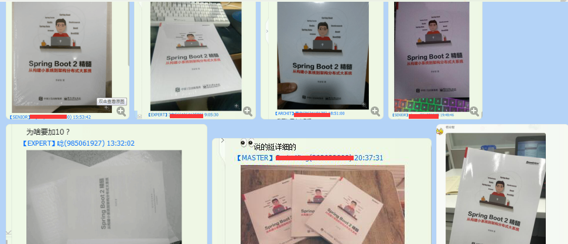

# 本书代码

所有代码在 https://gitee.com/xiandafu/Spring-Boot-2.0-Samples

本书的出版社地址是：http://item.jd.com/12214143.html

# 最新版本

由于写作本书的时候，Spring Boot 和 第三方集成工具版本一直在变化，因此这里列出验证过后的最新版本

* Spring Boot: 2.0.0.M6

~~~xml
<parent>
	<groupId>org.springframework.boot</groupId>
	<artifactId>spring-boot-starter-parent</artifactId>
	<version>2.0.0.M6</version>
</parent>
~~~

* beetl

~~~xml

<dependency>
    <groupId>com.ibeetl</groupId>
    <artifactId>beetl-framework-starter</artifactId>
    <version>1.1.22.RELEASE</version>
</dependency>
~~~

* HikariCP

~~~xml

 <dependency>
	<groupId>com.zaxxer</groupId>
	<artifactId>HikariCP</artifactId>
	<version>2.7.2</version>
</dependency>
~~~

* XLSUnit

~~~xml
<dependency>
    <groupId>com.ibeetl</groupId>
	<artifactId>xlsunit</artifactId>
	<version>1.0.8</version>
</dependency>
~~~

# 说明

在写作的时候，考虑到篇幅，有些内容并未加进来，或者加进来也脱离了主线。还有些是在写作后才发现还有不同的技术点可以进一步介绍。因此本页面是对原书内容的补充和漫谈,
漫谈部分可能**不像书中那么客观，会有些主观部分，如果引起你的不适，见谅**。

本书以作者在公司的开发平台经验为基础写作而成，对于没有涉及到的Spring Boot技术，敬请见谅

# 1 前言

## 1.1 为什么要使用Spring Boot

我的观点是：
* 其实每个公司（采用Spring技术的公司） 都有一个 Boot技术框架
* 一千个公司，就有一千个Boot框架

Spring 适时推出了集成度更高，更容易使用的Spring Boot框架，迅速流行起来，而Spring Boot 2，绝对是一个里程碑

## 1.2 学习Spring Boot 很难吗？

作为一个Java新手，学习Spring Boot 需要一些必备技能，否则就掌握不了

* JDK
* Maven

Spring Boot **并未要求掌握Spring技术**，这恰恰是Spring Boot 目的，就是简化Spring框架，相对于市面上的很多轻量级框架，Spring Boot实际上也是这种定位。他的好处是利于了Spring框架，集成了Spring体系的几乎所有技术，以及集成了业界流行的第三方技术。因此Spring Boot 其实功能更强大，相比于宣称所谓小巧的XXX MVC框架来说，他其实也很”小巧“（但体积不小巧，这个没办法，谁让Spring都这么多年了，都成胖大叔了）

Spring Boot 学习唯一麻烦是现在缺少正正全面的中文书籍介绍给国内用户，本书《Spring Boot 2 精髓》正是这样一本书。

## 1.3 如果以Debug模式启动本书例子会出怪事？

如果你以Debug模式运行本书的Spring Boot，Spring Boot在完全启动前会停留在SilentExitExceptionHandler，出了什么鬼？

~~~
SilentExitExceptionHandler{
	.....
	public static void exitCurrentThread() {
		throw new SilentExitException(); //即使没有打断点，IDE也会自动在这里停留
	}
  
}
~~~

这并不是Spring Boot特有现象，这是因为这里Spring Boot 抛出了一个捕获不了的异常(uncaught exceptions)

这种异常一般发生在线程的run方法里，导致线程异常退出，JDB（也就是Java Debug ，可以通过https://www.tutorialspoint.com/jdb/jdb_quick_guide.htm） 学习，默认情况下会对这情况进行断点。

如果要避免这种情况，可以配置JDB忽略这种uncaught exceptions，以Eclipse为例子，进入Java|Debug

勾选Suspend execution on uncaught exceptions 即可。

至于为什么Spring Boot会出现这种情况，这应该是与Spring Boot 热加载机制有关，具体可以参考：

https://github.com/spring-projects/spring-boot/issues/3100

## 1.4 SpringBoot1 和Spring Boot 2差别大吗？

有差别，但差别不大。基本上基于SpringBoot的代码不需要改动，但有些配置属性和配置类，可能要改动，改动原因是

* 配置已经不存在或者改名
* 类已经不存在改名

听着挺吓人，但我实际切换过程中改动的地方很少。一般正常的MVC，数据库访问这些都不需要改动,下面按照本书章节说明我曾碰到的区别

* 第1章，SpringBoot 2基于Spring5和JDK8，而Spring 1x则用的是JDK7，因此你的应用服务必须支持JDK8
* 第2章，无区别，使用SpringBoo2，建议使用较新的Maven版本，以及较新的JDK,尤其是IDE工具，以免Maven在IDE里的视图报出警告信息
* 第3章：MVC部分，有些定制类改动了，比如WebMvcConfiguer,由抽象类改为接口，这是因为JDK8对接口有新的支持形式，3.8章提到的统一错误处理，基类AbstarctErrorController也改动非常大，请参考书中描述的知识点。MVC里的视图渲染Freemaker视图解析器也有改动，默认情况下，它会自动加上ftl来来寻找模板
* 第4章：关于Beetl，无改动，请使用新版本即可
* 第5章，无改动，JDBCTemplate和BeetlSQL均可以使用
* 第6章，JPA中，findById 返回了一个Optional对象，**改动较大，会直接影响所有业务代码**，Page代码接口也有调整。
* 第7章，SpringBoot配置，web应用的ContextPath 配置属性已经改动，可以参考本文章的7.1.1 说明。另外配置文件的中文可以直接读取，而不需要转码。另外，自动装配里Boot提供的JavaVersion类报名改动了。根据jdk版本自动装配的需要调整代码
* 第8章，部署SpringBoot无改动
* 第9章，测试SpringBoot无改动
* 第10章，无改动，但Swagger UI变化较大。除了参考本书外，还需要密切注意Sawgger的最新特性
* 第11章， MongDB，无变化
* 第12章，Redis 无变化
* 第13章，ElasticSearch，无改动，应该说SpringBoot2做的更好了。需要密切注意Elastic Search本身版本变化，它也是版本帝，Spring Boot略有点根本上。因此不能担保在因为Elastci Search的RESTAPI变化导致Spring Boot不兼容，所以一定要使用Spring Boot指定的版本
* 第14章,基本无改动，但内部CacheManager和Cache的接口改动，因此缓存机制内部变化较大，书里提到的一二级分布式缓存实现方式变化就比较大

* 第15章，SpringSession 无变化

* 第16章，由于本书将的是用Curator集成Spring Boot，所以无变化

* 第17章，Acutator，本章SpringBoot1.x和2变化较大，默认情况，不再启用所有监控，另外编写自己监控信息，完全需要重写，HealthIndicator,EndPoint 变化很大

  ​

# 3 MVC框架

## 3.7  Spring内部是如何判断ModeAndView交给哪个模板引擎渲染的

对于Controller返回ModelAndView，Spring如何知道是交给Freemaker处理，还是Beetl处理呢？或者是其他模板引擎处理呢，实际上，Spring也不知道，但他会根据注册的AbstractTemplateViewResolver子类挨个询问“你是否能处理这种视图”

* Beetl的是org.beetl.ext.spring.BeetlSpringViewResolver
* Freemarker  org.springframework.web.servlet.view.FreeMarkerViewResolver

默认情况下，Beetl根据配置，认为能处理以btl结尾的视图（当然，也可以配置成处理html结尾的视图），

Freemaker 默认情况下 则会自动加上ftl后缀，检测项目是否存在这个文件（Beetl的也会检测是否存在这个文件）

如果存在，则回答Spring，说能处理，Spring则会交给这个视图处理器处理视图，从而渲染模板。

实际情况可能还更为复杂点，比如Spring会根据请求头信息来进一步筛选哪个视图处理器更合适，具体代码需要参考

org.springframework.web.servlet.view.ContentNegotiatingViewResolver.resolveViewName 方法

## 3.10 Curl和Postman

Curl是命令行工具，更适合写书的时候用 :)

在Window下使用curl，需要考虑转义，还有换行问题，很麻烦，建议在linux下用curl吧。或者用Postman

# 4 视图技术

## 4.1 为什么视图技术没有讲Thymeleaf 。

这里主要有俩个原因

* 我本身是Beetl模板引擎作者，很难出一本书里讲Thymeleaf技术
* Thymeleaf有很多我认为不好的地方，我在《[关于Thymeleaf的真相》](https://my.oschina.net/xiandafu/blog/1505526)已经有个详细说明，比如
  * 并非Spring Boot默认内置的模板引擎，Spring Boot支持很多模板引擎，并没有内置某一款模板语言
  * Thymeleaf并非所见所得，它一直宣称的观点是有误的。
  * Thymeleaf性能瓶颈
  * Thymeleaf的语法较为难学习，学习曲线很大。
* 模板语法一般有三种风格，xml方式，类似freemaker，比如“<if></if>”,指令方式，类似velocity，Thymeleaf。还有一种是Beetl这种方式，脚本方式。我个人更喜欢脚本方式，能处理较为复杂的逻辑渲染，而且，模板脚本和静态文本能区分开。每个人都有自己的审美，喜欢何种风格都没有问题。

## 4.2 前端模板引擎已经很流行了，后端模板引擎还有作用嘛？

beetl 是后端模板引擎，就你看到的绝大部分互联网页面都是后台模板引擎生成，还有不少传统管理系统也有后段模板引擎发挥的地方，前端模板引擎兴起主要是因为手机流行，而不是真的因为前端模板引擎可以代替后段模板引擎。后段模板引擎有些地方是不能代替的，如果站在前端模板引擎看后端：

1. 内容生成静态页面，大部分网站还需要后端生成静态页面分发。
2. 后段发送的邮件，微信，短信等还只能后端模板引擎生成，一些框架代码生成功能也需要
3. 对于SEO 优化来说，前端模板引擎对Baidu,Google 不友好。
4. 传统IT应用来说，后段模板引擎可以和前端模板引擎混合使用，后段模板引擎可以从布局等入手，前端模板引擎可以从页面片段入手，比如你看到的一个网页，用户登录信息现实可能是后段模板引擎渲染出来的，登录明细可能用前端模板引擎

前后端模板引擎主要区别来源于，前者更接近UI，后者更接近数据，因此，使用起来效果很不一样。

比如用户登录成功功能后，管理系统会在顶部显示登录用户的名称，性别，所属公司，这是用后段模板引擎渲染还是前端模板引擎渲染好呢？无论从UI体验，还是系统效率来说，后端模板引擎更合适，当用户看到页面，就能看到自己信息，而不需要另外一次JSON加载和前端渲染，这在计算机术语中，叫着“”捎带“，普遍用于互联网传输。

再比如，要是显示此登录用户性别，我们知道，性别肯定以数字存放到数据库，如果是后段模板引擎渲染，可以从数据字典缓存里取出置换成性别。如果是前端模板引擎，由于远离数据，因此必须要求后端准备好一切数据（即显示模型），略有点麻烦。

另外，从页面整体布局来看，这还是后段模板引擎强项，Beetl提供layout，include等布局方式，并可以灵活切换布局风格，对于前端模板引擎，这方面功能还是很弱，或者还没有精力完善。

最后，后段模板引擎发展了好多年，功能强大，错误提示完善。前端模板引擎由于追求体积小，因此这俩方面都弱了点，也势必不会很强大。

在我的项目里，也使用前端模板引擎，但基本上是些片段数据。主要还是用了后段模板引擎，和一些现成的UI控件，如bootstraptable。

至于前后端分离，Beetl也支持，前后端团队协作开发页面。

# 5 数据库访问

## 5.1 如何使用JNDI 数据源

对于大部分传统企业应用，都是部署在应用服务器，应用服务器提供了一些服务，如提供了数据源，SpringBoot可以在部署的时候时候JNDI数据源，只需要在配置文件指名数据源的名字即可

~~~properties
spring.datasource.jndi-name=java:xxx/datasources/xxpool
~~~

这段代码在JndiDataSourceAutoConfiguration，如果你已经看过第7章，那下面代码你应该能看懂

~~~java
@ConditionalOnClass({ DataSource.class, EmbeddedDatabaseType.class })
@ConditionalOnProperty(prefix = "spring.datasource", name = "jndi-name")
@EnableConfigurationProperties(DataSourceProperties.class)
public class JndiDataSourceAutoConfiguration {
	@Bean(destroyMethod = "")
	@ConditionalOnMissingBean
	public DataSource dataSource(DataSourceProperties properties) {
		JndiDataSourceLookup dataSourceLookup = new JndiDataSourceLookup();
		DataSource dataSource = dataSourceLookup.getDataSource(properties.getJndiName());
		excludeMBeanIfNecessary(dataSource, "dataSource");
		return dataSource;
	}
}
~~~

如果你的应用是多个JNDI的数据源，你可以参考这个源码构造使用JNDI 构造多个Datasource

至于开发时候使用自己配置的，不熟使用应用服务器数据源，拿你需要掌握书里的关于第8章的知识了

## 5.2 BeetlSQL 和Hibernte ，还有MyBatis 的差别

我曾写了一个博客，介绍了一下我认为的这三个的差别，博客地址在:

https://my.oschina.net/xiandafu/blog/617542

简单的来讲，我更认可BeetlSQL和Mybatis这种风格的ORM工具。关于结合SpringBoot，我们知道，BeetlSQL结合Spring Boot，应该是启动最快的了。比较适合Spring Boot快速启动和热启动

# 7 Spring Boot 配置

## 7.1.1 新版旧版配置Context Path方式不同

Spring Boot 2  和 Spring Boot 1在配置Context Path的时候，目前看来不兼容，旧版本配置是

~~~properties
server.context-path=/config
~~~

2.0新版本是

~~~properties
server.servlet.context-path=/config
~~~

写作过程中，及时发现了这个变化，但这一节改动不一致，请以server.servlet.context-path为准

# 8 部署Spring Boot 应用

## 8.2 如果非要部署到老旧的应用服务器上？
书中写明了以war方式部署，针对的是servlet3.0 标准，也就是tomcat8，或者weblogic 12.如果你手里的服务器并不支持servlet3.0标准，还需要使用web.xml 方式，按照如下部署

* 在Spring Boot工程的main/src 目录下新建一个叫webapp的目录，再创建一个WEB-INF目录，创建web.xml ，内容如下：

~~~xml
<?xml version="1.0" encoding="UTF-8"?>
<web-app version="2.5" xmlns="http://java.sun.com/xml/ns/javaee"
    xmlns:xsi="http://www.w3.org/2001/XMLSchema-instance"
    xsi:schemaLocation="http://java.sun.com/xml/ns/javaee http://java.sun.com/xml/ns/javaee/web-app_2_5.xsd">

	<context-param>
		<param-name>contextConfigLocation</param-name>
		<param-value>com.xxx.YourApplication</param-value>
	</context-param>

	<listener>
		<listener-class>org.springframework.boot.legacy.context.web.SpringBootContextLoaderListener</listener-class>
	</listener>
    <servlet>
        <servlet-name>appServlet</servlet-name>
        <servlet-class>org.springframework.web.servlet.DispatcherServlet</servlet-class>
        <init-param>
            <param-name>contextAttribute</param-name>
            <param-value>org.springframework.web.context.WebApplicationContext.ROOT</param-value>
        </init-param>
        <load-on-startup>1</load-on-startup>
    </servlet>

    <servlet-mapping>
        <servlet-name>appServlet</servlet-name>
        <url-pattern>/</url-pattern>
    </servlet-mapping>

</web-app>

~~~

类名com.xxx.YourApplication 代表了你的程序入口，即用@SpringBootApplication 标注的Spring Boot类

* org.springframework.boot.legacy.context.web.SpringBootContextLoaderListener 是属于独立维护的工程，因此，你还需显示的导入

~~~xml
<dependency>
    <groupId>org.springframework.boot</groupId>
    <artifactId>spring-boot-legacy</artifactId>
    <version>1.1.0.RELEASE</version>
</dependency>
~~~

# 9 单元测试

# 9.3 Mockito 测试出现了UnnecessaryStubbingException是什么鬼？

这个出现并不会影响单元测试结果，它提示了你使用Mockito，对测试对象返回值进行了模拟，但你实际并没有做这个测试，因此他建议你不必要模拟，比如

~~~java

@Test
public void test3() {
	
	// 创建mock对象
	List list = mock(List.class);
	doThrow(new UnsupportedOperationException("不支持clear方法调用")).when(list).clear();;
	//list.clear();
}

~~~

如上代码注释了要测试list.clear(),将会导致UnnecessaryStubbingException警告。因为你只模拟了clear方法抛出异常，但你并未测试。

# 17 监控Spring Boot 应用

## 17.5  内存信息新版有Bug

根据新升级的版本，heapdump 存在bug，当改变Acutator端口与web端口不一样的时候，heapdump功能失效。这个bug报告是我发起的

https://github.com/spring-projects/spring-boot/issues/11046

据说将在2.0.0.M7 修复。

为了体验这个功能，请不要配置Acutator端口